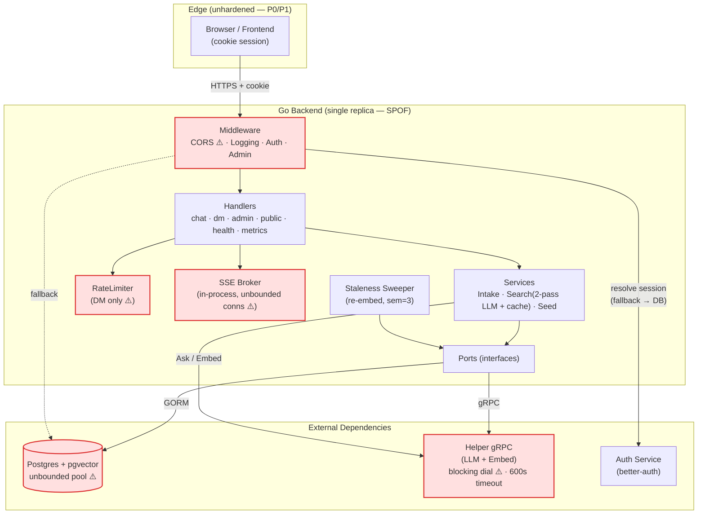

# HelpingPeople Backend — Architecture / Reliability / Security Audit & Outage FMEA

> **Scope:** `/home/atorresp/projects/HelpingPeople/backend` (Go REST API, hexagonal/DDD, gRPC→helper LLM, Postgres+pgvector).
> **Mode:** Read-only audit. No source files were modified. All fixes below are *suggested* diffs.
> **Date:** 2026-06-30 · **Lead:** Senior Architect + Reliability + Security review.

---

## 1. Executive Summary

The backend is a well-structured hexagonal application: ports/adapters boundaries are respected, the service layer never imports `*gorm.DB`, branch-selection for vector search is post-fact, and graceful shutdown / re-embed draining are thoughtfully implemented. Test coverage gates are enforced in CI. **The architecture is sound.** The risk is concentrated not in *design* but in *runtime hardening* — the process is missing the standard "edge" protections that keep a single-replica, LLM-backed service alive under load or attack.

The three highest-severity issues are all **trivially exploitable or trivially triggered, and all lead to a full outage or data exposure**:

1. **CORS reflects any `Origin` with `Access-Control-Allow-Credentials: true`** (`internal/adapters/middleware/cors.go`). Combined with cookie-based session auth, *any* website can issue credentialed requests against the API on behalf of a logged-in user and read the responses. The in-repo claim that this is "safe because Origin can't be spoofed" is **incorrect** — reflection defeats the Same-Origin Policy. This is a credential/data-exfiltration vector. **(P0)**
2. **`http.Server` has no timeouts** (`main.go`) — no `ReadHeaderTimeout`, `ReadTimeout`, or `IdleTimeout`. A handful of slow/idle connections (Slowloris) exhausts the listener with no authentication required. **(P0)**
3. **No database connection-pool bounds** (`database/postgres.go`) — GORM defaults to an *unbounded* `MaxOpenConns`. A latency spike (e.g. the 600 s helper timeout configured in docker-compose) lets in-flight requests open connections without limit until Postgres refuses new ones, taking down every code path at once. **(P0)**

The next tier (**P1**) is dominated by **cost and cascading-failure risk**: the `/api/v1/chat` and `search` paths have **no request-size cap and no rate limit** (only direct messaging is limited), so a single authenticated client can drive unbounded LLM spend and memory; and the gRPC client performs a **blocking dial while holding a mutex**, so a degraded helper serializes every request behind a 5 s lock instead of failing fast.

**Bottom line:** Ship the P0 edge-hardening (timeouts, pool bounds, CORS allow-list) before the next traffic increase. The P1 set removes the cost-blowout and cascading-failure modes. None of these require architectural change — they are localized, low-risk, reversible edits.

| Severity | Count | Theme |
|---|---|---|
| P0 | 3 | Outage / data-exfil, trivially triggered |
| P1 | 5 | Cost blowout, cascading failure, info disclosure |
| P2 | 6 | Memory growth, hardening, defense-in-depth |
| P3 | 4 | Observability & operability polish |

---

## 2. System & Failure-Domain Diagram



**Failure domains & blast radius**

| Domain | If it fails | Blast radius | Current mitigation |
|---|---|---|---|
| Postgres | Total | All endpoints | Health probe only; **no pool cap** |
| Helper gRPC | Chat/intake 503; search degrades to ILIKE | LLM features | ILIKE fallback (good); **blocking dial amplifies** |
| Auth service | Admin 503; user auth degrades | Admin + new sessions | **DB session fallback (good)** |
| Backend replica | Total | Everything | Single replica = SPOF |
| LLM latency (600 s) | Goroutine/conn pileup | Cascades to Postgres | **None** |

---

## 3. Outage FMEA (Failure Mode & Effects Analysis)

Risk Priority Number (RPN) = Severity × Likelihood × Detectability, each 1–5 (higher = worse).

| # | Failure mode | Cause | Effect | Sev | Lik | Det | RPN | Fix |
|---|---|---|---|---|---|---|---|---|
| F1 | Listener exhaustion | No server timeouts; Slowloris/idle conns | Full outage, unauth | 5 | 4 | 4 | **80** | P0-2 |
| F2 | Postgres conn exhaustion | Unbounded pool + slow LLM holding requests | Full outage | 5 | 4 | 3 | **60** | P0-3 |
| F3 | Credential/data theft | CORS reflect-any-origin + credentials | Account/data compromise | 5 | 3 | 4 | **60** | P0-1 |
| F4 | LLM cost blowout | No size cap / rate limit on chat+search | Runaway spend, OOM | 4 | 4 | 3 | **48** | P1-1 |
| F5 | Cascading latency on helper degrade | Blocking gRPC dial under mutex | Every request stalls ≤5 s | 4 | 3 | 3 | **36** | P1-2 |
| F6 | Memory growth → OOM | Unbounded search cache + SSE conns | Slow OOM crash | 3 | 3 | 3 | **27** | P1-4, P2-1 |
| F7 | Info disclosure | `/health` & error bodies leak internal errors | Recon aid | 3 | 4 | 2 | **24** | P1-3 |
| F8 | Auth bypass (theoretical) | DB-fallback skips cookie HMAC verification | Session forgery if token leaks | 4 | 1 | 4 | **16** | P2-3 |
| F9 | Metrics scrape leak | `/metrics` unauthenticated | Recon (paths, volumes) | 2 | 3 | 2 | **12** | P2-2 |
| F10 | Migration lock on boot | HNSW/ALTER not `CONCURRENTLY` | Slow cold start at scale | 2 | 2 | 3 | **12** | P3 |

---

## 4. Prioritized Backlog (P0 → P3)

### P0 — Do before next traffic increase (outage / data-exfil)

- **P0-1 — Lock down CORS to an allow-list.** Replace origin reflection with an env-driven allow-list (`ALLOWED_ORIGINS`). Only echo `Access-Control-Allow-Origin` + `Allow-Credentials` for matched origins. *(`internal/adapters/middleware/cors.go`)*
- **P0-2 — Add `http.Server` timeouts.** Set `ReadHeaderTimeout`, `ReadTimeout`, `IdleTimeout`. **Do not** set `WriteTimeout` (would kill SSE); rely on SSE's own context. *(`main.go`)*
- **P0-3 — Bound the DB connection pool.** `SetMaxOpenConns`, `SetMaxIdleConns`, `SetConnMaxLifetime`, `SetConnMaxIdleTime` right after `gorm.Open`. *(`database/postgres.go`)*

### P1 — Next sprint (cost, cascading failure, info disclosure)

- [SHIPPED] **P1-1 — Cap request body + rate-limit chat/search.** `http.MaxBytesReader` on chat body; reject `len(message) > 8000`; add a per-user token bucket to the chat handler (reuse `ratelimit.RateLimiter`). *(`chat_handler.go`, `main.go`)*
- **P1-2 — Make the gRPC client fail fast.** Replace `grpc.DialContext(..., WithBlock())` (deprecated, blocks under mutex) with lazy `grpc.NewClient` + keepalive params; never hold `s.mu` across a network dial. *(`internal/adapters/llm/grpc_client.go`)*
- **P1-3 — Stop leaking internal errors.** `/health` must not return `err.Error()` to unauthenticated callers; log details, return generic status. Same for admin/LLM 5xx bodies. *(`health_handler.go`, `response.go`, `admin_table.go`)*
- [SHIPPED] **P1-4 — Bound the search cache.** Add size cap + opportunistic expiry eviction to `searchCache` (currently grows with distinct queries forever). *(`internal/services/search_service.go`)*
- **P1-5 — Per-user SSE connection cap.** Reject/replace beyond N (e.g. 5) concurrent streams per user to bound fd/goroutine/memory. *(`internal/adapters/realtime/sse_broker.go` + handler)*

### P2 — Hardening / defense-in-depth

- **P2-1 — Periodic search-cache + reembed-timer sweep metrics** (size gauges) to make F6 observable.
- **P2-2 — Protect `/metrics`** behind network policy or a bearer token; do not expose publicly.
- **P2-3 — Verify cookie HMAC in DB-fallback auth** (`rawSessionToken` drops the signature; DB lookup matches the unsigned token only). Add signature validation or document the trust boundary.
- **P2-4 — `DisallowUnknownFields()`** on inbound JSON decoders to reject malformed/oversized payloads early.
- **P2-5 — Check the ignored `Decode` error** in `report` handler; validate `reason` length.
- **P2-6 — Add `ReadHeaderTimeout` awareness for SSE** and a max-stream-duration so abandoned streams are reclaimed.

### P3 — Observability & operability

- **P3-1 — Emit `chat_llm_duration_seconds`** from the chat path (helper instrumentation already exists but `ObserveChatLLMDuration` is not wired from `ChatHandler`).
- **P3-2 — Add gauges**: `search_cache_size`, `sse_active_connections`, `db_pool_in_use` for the alerts below.
- **P3-3 — Run HNSW index + dim-pin ALTER with `CONCURRENTLY`** in a separate idle migration at scale.
- **P3-4 — Add request IDs / trace propagation** through middleware → services → gRPC metadata for cross-service debugging.

---

## 5. Prometheus Alerting Rules

> Metric names verified against `internal/adapters/handler/metrics_handler.go`. Histograms expose `_bucket`/`_sum`/`_count`. `health_status` is a gauge (1=healthy). Add the **bold** gauges in P3-2 to enable the commented alerts.

```yaml
groups:
  - name: helpingpeople-backend
    rules:
      # ── Availability ──────────────────────────────────────────────
      - alert: BackendDown
        expr: up{job="helpingpeople-backend"} == 0
        for: 1m
        labels: { severity: page }
        annotations:
          summary: "Backend instance down"
          runbook: "RB-1"

      - alert: PostgresUnhealthy
        expr: health_status{component="postgres"} == 0
        for: 1m
        labels: { severity: page }
        annotations:
          summary: "Postgres health probe failing"
          runbook: "RB-2"

      - alert: HelperGRPCUnhealthy
        expr: health_status{component="grpc_helper"} == 0
        for: 3m
        labels: { severity: warning }
        annotations:
          summary: "Helper gRPC degraded (search will fall back to ILIKE)"
          runbook: "RB-3"

      # ── Error budgets ─────────────────────────────────────────────
      - alert: HighHTTP5xxRate
        expr: |
          sum(rate(http_requests_total{status=~"5.."}[5m]))
            / sum(rate(http_requests_total[5m])) > 0.05
        for: 5m
        labels: { severity: page }
        annotations:
          summary: ">5% of HTTP responses are 5xx"
          runbook: "RB-4"

      - alert: HighLLMErrorRate
        expr: sum(rate(chat_llm_errors_total[5m])) > 0.2
        for: 5m
        labels: { severity: warning }
        annotations:
          summary: "Elevated LLM/helper error rate"
          runbook: "RB-3"

      # ── Latency (Slowloris / pool exhaustion early signal) ────────
      - alert: HighRequestLatencyP95
        expr: |
          histogram_quantile(0.95,
            sum(rate(http_request_duration_seconds_bucket[5m])) by (le, path)
          ) > 2
        for: 10m
        labels: { severity: warning }
        annotations:
          summary: "p95 request latency > 2s on {{ $labels.path }}"
          runbook: "RB-5"

      # ── Cost / abuse ──────────────────────────────────────────────
      - alert: ChatRequestSurge
        expr: sum(rate(chat_requests_total[5m])) > 5  # tune to baseline×5
        for: 10m
        labels: { severity: warning }
        annotations:
          summary: "Chat request rate surge — possible cost abuse (F4)"
          runbook: "RB-6"

      # ── Vector search quality ─────────────────────────────────────
      - alert: VectorSearchFallbackSpike
        expr: |
          sum(rate(vector_search_total{branch=~"ilike_fallback|ilike_disabled_via_env"}[10m]))
            / sum(rate(vector_search_total[10m])) > 0.5
        for: 15m
        labels: { severity: warning }
        annotations:
          summary: ">50% of searches fell back off the vector branch"
          runbook: "RB-3"

      - alert: LowVectorScores
        expr: |
          histogram_quantile(0.5, sum(rate(vector_score_bucket[15m])) by (le)) < 0.35
        for: 30m
        labels: { severity: info }
        annotations:
          summary: "Median vector top-score < 0.35 (embedding/model drift?)"

      # ── P3-2 gauges (enable after instrumenting) ──────────────────
      # - alert: DBPoolSaturation
      #   expr: db_pool_in_use / db_pool_max > 0.9
      # - alert: SSEConnectionFlood
      #   expr: sse_active_connections > 5000
      # - alert: SearchCacheUnbounded
      #   expr: search_cache_size > 50000
```

### Grafana dashboard panels (suggested)

1. **Golden signals row** — req rate, error % (`status=~"5.."`), p50/p95/p99 from `http_request_duration_seconds_bucket`, in-flight.
2. **Dependency health** — `health_status{component=~"postgres|grpc_helper"}` as stat panels.
3. **LLM cost** — `rate(chat_requests_total[5m])` by `mode`, `rate(chat_llm_errors_total[5m])`, `chat_llm_duration_seconds` p95 (after P3-1).
4. **Vector search** — `vector_search_total` by `branch` (stacked), `vector_score` heatmap.
5. **DM activity** — `dm_sent_total` / `dm_received_total`.
6. **Saturation (P3-2)** — DB pool in-use, SSE active connections, search-cache size.

---

## 6. Runbooks

**RB-1 · Backend down**
1. `kubectl get pods` / check replica + `up` metric. 2. `GET /health` — note `postgres`/`grpc_helper` fields. 3. Check OOMKilled (F6) → inspect memory trend; restart restores service but recurs → escalate P1-4/P1-5. 4. Check for connection flood (F1/F2) in logs (`request started` spam from one IP) → apply edge rate limit at proxy as stopgap. 5. Roll back last deploy if correlated.

**RB-2 · Postgres unhealthy**
1. Confirm DB reachability from a pod. 2. `SELECT count(*) FROM pg_stat_activity;` — if near `max_connections`, this is F2 (pool exhaustion). 3. Stopgap: lower app replicas / restart to drop connections. 4. Permanent: ship **P0-3** (pool bounds). 5. Check for long-running LLM-held transactions (600 s timeout) blocking connections.

**RB-3 · Helper gRPC degraded / LLM errors**
1. `GET /health` → `grpc_helper: down`. 2. Search still works via ILIKE fallback (`vector_search_total{branch="ilike_fallback"}` rises) — confirm user-visible search OK. 3. Chat/intake return 503 → check helper logs/Ollama. 4. If helper is slow (not down) and requests pile up, this is F5 → ship **P1-2** (fail-fast dial). 5. Rate-limit at the LLM provider if 429s (`RATE_LIMIT` prefix → friendly 200).

**RB-4 · HTTP 5xx spike**
1. Break down `http_requests_total{status=~"5.."}` by `path`. 2. `/api/v1/chat` 503 → helper (RB-3). 3. Broad 5xx across paths → Postgres (RB-2) or pool exhaustion. 4. Check recent deploy; roll back.

**RB-5 · Latency spike**
1. p95 by `path`. 2. If `/api/v1/chat` only → helper latency (RB-3). 3. If all paths → DB contention or pool starvation (RB-2). 4. If many idle/slow connections from few IPs → Slowloris (F1) → ship **P0-2**, block at proxy now.

**RB-6 · Chat/cost surge**
1. Identify offending user from `chat request` logs (`user_id`). 2. Stopgap: block user / lower proxy rate limit. 3. Confirm body-size + rate-limit fix (**P1-1**) is deployed. 4. Review LLM provider spend dashboard.

---

## 7. Suggested Patches (P0/P1) — apply_patch style

> Read-only audit: these are **proposed** and have **not** been applied. Each is localized and reversible.

### P0-1 — CORS allow-list (`internal/adapters/middleware/cors.go`)

```diff
*** Begin Patch
*** Update File: internal/adapters/middleware/cors.go
@@
-package middleware
-
-import "net/http"
-
-func CORS(next http.Handler) http.Handler {
-	return http.HandlerFunc(func(w http.ResponseWriter, r *http.Request) {
-		if origin := r.Header.Get("Origin"); origin != "" {
-			w.Header().Set("Access-Control-Allow-Origin", origin)
-			w.Header().Set("Access-Control-Allow-Credentials", "true")
-			w.Header().Set("Vary", "Origin")
-		}
-		w.Header().Set("Access-Control-Allow-Methods", "GET, POST, PUT, PATCH, DELETE, OPTIONS")
-		w.Header().Set("Access-Control-Allow-Headers", "Content-Type, Authorization")
-		if r.Method == http.MethodOptions {
-			w.WriteHeader(http.StatusNoContent)
-			return
-		}
-		next.ServeHTTP(w, r)
-	})
-}
+package middleware
+
+import (
+	"net/http"
+	"os"
+	"strings"
+)
+
+// allowedOrigins is built once from the comma-separated ALLOWED_ORIGINS env
+// var (e.g. "https://app.helpingpeople.now,https://www.helpingpeople.now").
+// Reflecting an arbitrary Origin together with Allow-Credentials defeats the
+// Same-Origin Policy and lets any site issue credentialed requests, so we
+// only ever echo an Origin we explicitly trust.
+var allowedOrigins = func() map[string]struct{} {
+	m := map[string]struct{}{}
+	for _, o := range strings.Split(os.Getenv("ALLOWED_ORIGINS"), ",") {
+		if o = strings.TrimSpace(o); o != "" {
+			m[o] = struct{}{}
+		}
+	}
+	return m
+}()
+
+func originAllowed(origin string) bool {
+	_, ok := allowedOrigins[origin]
+	return ok
+}
+
+func CORS(next http.Handler) http.Handler {
+	return http.HandlerFunc(func(w http.ResponseWriter, r *http.Request) {
+		origin := r.Header.Get("Origin")
+		if origin != "" && originAllowed(origin) {
+			w.Header().Set("Access-Control-Allow-Origin", origin)
+			w.Header().Set("Access-Control-Allow-Credentials", "true")
+			w.Header().Set("Vary", "Origin")
+			w.Header().Set("Access-Control-Allow-Methods", "GET, POST, PUT, PATCH, DELETE, OPTIONS")
+			w.Header().Set("Access-Control-Allow-Headers", "Content-Type, Authorization")
+		}
+		if r.Method == http.MethodOptions {
+			// Preflight: 204 with headers only when the origin was allowed above.
+			w.WriteHeader(http.StatusNoContent)
+			return
+		}
+		next.ServeHTTP(w, r)
+	})
+}
*** End Patch
```

> **Note:** same-origin requests send no `Origin` header and continue to work with no CORS headers (unchanged behavior). Set `ALLOWED_ORIGINS` in the deployment env.

### P0-2 — HTTP server timeouts (`main.go`)

```diff
*** Begin Patch
*** Update File: main.go
@@
-	server := &http.Server{
-		Addr:    ":" + port,
-		Handler: middleware.Logging(mux),
-	}
+	server := &http.Server{
+		Addr:    ":" + port,
+		Handler: middleware.Logging(mux),
+		// Slowloris / idle-connection protection (F1). No WriteTimeout:
+		// the SSE /stream endpoint holds the response open indefinitely and
+		// manages its own lifecycle via request context + 25s heartbeat.
+		ReadHeaderTimeout: 10 * time.Second,
+		ReadTimeout:       30 * time.Second,
+		IdleTimeout:       120 * time.Second,
+	}
*** End Patch
```

> `time` is already imported in `main.go`. No other change required.

### P0-3 — Bound DB connection pool (`database/postgres.go`)

```diff
*** Begin Patch
*** Update File: database/postgres.go
@@
 	db, err := gorm.Open(postgres.Open(dsn), &gorm.Config{
 		Logger: logger.Default.LogMode(logger.Warn),
 	})
 	if err != nil {
 		return nil, fmt.Errorf("failed to connect to database: %w", err)
 	}
+
+	// Bound the pool (F2). Without this GORM uses database/sql defaults
+	// (MaxOpenConns unlimited), so a latency spike — e.g. the 600s helper
+	// timeout — lets in-flight requests open connections until Postgres
+	// rejects new ones, taking down every code path at once.
+	if sqlDB, derr := db.DB(); derr == nil {
+		sqlDB.SetMaxOpenConns(20)
+		sqlDB.SetMaxIdleConns(10)
+		sqlDB.SetConnMaxLifetime(time.Hour)
+		sqlDB.SetConnMaxIdleTime(10 * time.Minute)
+	} else {
+		slog.Warn("database: could not access *sql.DB to configure pool", "error", derr)
+	}
*** End Patch
```

> Add `"time"` to the import block in `database/postgres.go` (currently imports `fmt`, `log/slog`, `os`, plus the gorm packages). Tune `MaxOpenConns` to stay under Postgres `max_connections` ÷ replica count.

### P1-1 — Body cap + chat rate limit (`chat_handler.go`)

```diff
*** Begin Patch
*** Update File: internal/adapters/handler/chat_handler.go
@@
 type ChatHandler struct {
 	intakeService *services.IntakeService
 	searchService *services.SearchService
 	prompts       ports.SystemPromptRepository
+	limiter       *ratelimit.RateLimiter
 }
 
 func NewChatHandler(
 	intakeService *services.IntakeService,
 	searchService *services.SearchService,
 	prompts ports.SystemPromptRepository,
+	limiter *ratelimit.RateLimiter,
 ) *ChatHandler {
 	return &ChatHandler{
 		intakeService: intakeService,
 		searchService: searchService,
 		prompts:       prompts,
+		limiter:       limiter,
 	}
 }
@@
 	if r.Method != http.MethodPost {
 		writeError(w, http.StatusMethodNotAllowed, "method not allowed")
 		return
 	}
 
-	var req chatRequest
-	if err := json.NewDecoder(r.Body).Decode(&req); err != nil {
+	// Cap inbound body to 64 KiB so a giant payload can't OOM the process
+	// or balloon LLM token cost (F4).
+	r.Body = http.MaxBytesReader(w, r.Body, 64<<10)
+	var req chatRequest
+	if err := json.NewDecoder(r.Body).Decode(&req); err != nil {
 		writeError(w, http.StatusBadRequest, "invalid json")
 		return
 	}
 	if req.Message == "" {
 		writeError(w, http.StatusBadRequest, "message cannot be empty")
 		return
 	}
+	if len(req.Message) > 8000 {
+		writeError(w, http.StatusBadRequest, "message too long")
+		return
+	}
+
+	userID := contextkeys.GetUserID(r.Context())
+	if h.limiter != nil && userID != "" && !h.limiter.Allow(userID+":chat") {
+		writeError(w, http.StatusTooManyRequests, "rate_limited")
+		return
+	}
@@
-	userID := contextkeys.GetUserID(r.Context())
-	provider := ""
+	provider := ""
*** End Patch
```

```diff
*** Begin Patch
*** Update File: main.go
@@
-	mux.Handle("/api/v1/chat", middleware.CORS(d.Auth.Wrap(handler.NewChatHandler(d.Intake, d.Search, d.PromptRepo))))
+	chatRateLimiter := ratelimit.NewRateLimiter(20, time.Minute) // 20 chat/search calls per user per minute
+	mux.Handle("/api/v1/chat", middleware.CORS(d.Auth.Wrap(handler.NewChatHandler(d.Intake, d.Search, d.PromptRepo, chatRateLimiter))))
*** End Patch
```

> `ratelimit` and `time` are already imported in `main.go`; `contextkeys` is already imported in `chat_handler.go`. Add `"github.com/HelpingPeopleNow/backend/internal/adapters/ratelimit"` to `chat_handler.go` imports. Update existing `NewChatHandler` call sites in tests.

### P1-2 — Fail-fast gRPC client (`internal/adapters/llm/grpc_client.go`)

```diff
*** Begin Patch
*** Update File: internal/adapters/llm/grpc_client.go
@@
 import (
 	"context"
 	"fmt"
 	"log/slog"
 	"net/http"
 	"os"
 	"strconv"
 	"strings"
 	"sync"
 	"time"
 
 	"github.com/HelpingPeopleNow/backend/internal/ports"
 	pb "github.com/HelpingPeopleNow/backend/proto/helper"
 	"google.golang.org/grpc"
+	"google.golang.org/grpc/credentials/insecure"
+	"google.golang.org/grpc/keepalive"
-	"google.golang.org/grpc/credentials/insecure"
 )
@@
-func (s *GRPCLLMService) ensureClient() error {
-	s.mu.Lock()
-	defer s.mu.Unlock()
-	if s.client != nil {
-		return nil
-	}
-
-	dialCtx, cancel := context.WithTimeout(context.Background(), 5*time.Second)
-	defer cancel()
-
-	slog.Info("llm: dialing helper gRPC", "addr", s.addr)
-	conn, err := grpc.DialContext(dialCtx, s.addr,
-		grpc.WithTransportCredentials(insecure.NewCredentials()),
-		grpc.WithBlock(),
-	)
-	if err != nil {
-		return fmt.Errorf("gRPC dial %s: %w", s.addr, err)
-	}
-	s.conn = conn
-	s.client = pb.NewHelperServiceClient(conn)
-	slog.Info("llm: helper gRPC connected", "addr", s.addr)
-	return nil
-}
+func (s *GRPCLLMService) ensureClient() error {
+	s.mu.Lock()
+	defer s.mu.Unlock()
+	if s.client != nil {
+		return nil
+	}
+
+	// Lazy, NON-blocking dial (F5). grpc.NewClient returns immediately and
+	// connects on first RPC; the per-call context timeout in Ask/Embed bounds
+	// connection-establishment latency. The old DialContext+WithBlock held
+	// s.mu for up to 5s while the network dial completed, so a degraded helper
+	// serialized every request behind this lock.
+	slog.Info("llm: creating helper gRPC client", "addr", s.addr)
+	conn, err := grpc.NewClient(s.addr,
+		grpc.WithTransportCredentials(insecure.NewCredentials()),
+		grpc.WithKeepaliveParams(keepalive.ClientParameters{
+			Time:                30 * time.Second,
+			Timeout:             10 * time.Second,
+			PermitWithoutStream: true,
+		}),
+	)
+	if err != nil {
+		return fmt.Errorf("gRPC new client %s: %w", s.addr, err)
+	}
+	s.conn = conn
+	s.client = pb.NewHelperServiceClient(conn)
+	return nil
+}
*** End Patch
```

> `grpc.NewClient` is the supported replacement for the deprecated `DialContext`/`WithBlock`. The health endpoint and per-call timeouts already gate liveness, so dropping `WithBlock` is safe.

### P1-3 — Stop leaking internal errors (`health_handler.go`)

```diff
*** Begin Patch
*** Update File: internal/adapters/handler/health_handler.go
@@
 	if sqlDB, err := h.db.DB(); err != nil {
 		resp.Postgres = "down"
-		resp.Details["postgres_err"] = err.Error()
 		slog.Error("health: postgres unavailable", "error", err)
 	} else if err := sqlDB.PingContext(ctx); err != nil {
 		resp.Postgres = "down"
-		resp.Details["postgres_err"] = err.Error()
 		slog.Error("health: postgres ping failed", "error", err)
 	}
 
 	if err := h.llm.Health(ctx); err != nil {
 		resp.GRPCHelper = "down"
-		resp.Details["grpc_helper_err"] = err.Error()
 		slog.Error("health: helper gRPC degraded", "error", err)
 	}
*** End Patch
```

> Keeps the public `/health` body to status fields only (`status`/`postgres`/`grpc_helper`); the underlying error is still logged for operators. Apply the same principle to `admin_table.go` (`fmt.Sprintf("query failed: %s", err.Error())`) and `response.go` `handleLLMError` (`"helper service error: "+errStr`) — return generic text, log the detail.

### P1-4 — Bound the search cache (`internal/services/search_service.go`)

```diff
*** Begin Patch
*** Update File: internal/services/search_service.go
@@
 	newFloor, _ := s.currentWorkerFloor(ctx)
 	s.searchCacheMu.Lock()
+	// Bound cache size (F6). Opportunistically drop expired entries; if still
+	// over the cap, clear it wholesale (cheap, correctness-preserving — worst
+	// case is a cold cache, not stale results).
+	const maxSearchCacheEntries = 10000
+	if len(s.searchCache) >= maxSearchCacheEntries {
+		for k, v := range s.searchCache {
+			if time.Since(v.cachedAt) >= s.searchCacheTTL {
+				delete(s.searchCache, k)
+			}
+		}
+		if len(s.searchCache) >= maxSearchCacheEntries {
+			s.searchCache = make(map[string]searchCacheEntry, maxSearchCacheEntries)
+		}
+	}
 	s.searchCache[cacheKey] = searchCacheEntry{
 		result: &cacheVal, cachedAt: time.Now(), workerFloor: newFloor,
 	}
 	s.searchCacheMu.Unlock()
*** End Patch
```

---

## 8. What's already good (keep doing)

- **Clean hexagonal boundaries** — services depend only on `internal/ports`; the one documented exception (`DirectMessagingHandler`) is justified and still avoids `*gorm.DB`.
- **Parameterized SQL everywhere** — even the dynamic admin CRUD uses a fixed allow-list (`entities` map) + `gorm.Expr` only for vetted table names; the vector query uses bound `$1/$2/$3` params. No SQL-injection surface found.
- **Auth resilience** — auth-service-first with DB session fallback keeps logins working through an auth-service outage.
- **Vector search degradation** — post-fact branch reporting + ILIKE fallback means a failed embed/helper degrades gracefully instead of erroring.
- **Graceful shutdown** — coordinated `cancelRoot()` → `server.Shutdown` → bounded sweeper drain is well-reasoned and correctly avoids orphaned re-embed writes.
- **Idempotent migrations** — `IF NOT EXISTS` guards and the conditional `vector(768)` ALTER avoid per-boot table locks.
- **DM input validation** — body length capped (1–4000), participant checks, block/report flows, per-user rate limit.

---

## 9. Appendix — File reference index

| Concern | File |
|---|---|
| Composition root, server, shutdown | [main.go](main.go) |
| DB connect + migrations + pool | [database/postgres.go](database/postgres.go) |
| CORS / Auth / Admin / Logging | [internal/adapters/middleware/cors.go](internal/adapters/middleware/cors.go), [auth.go](internal/adapters/middleware/auth.go), [admin.go](internal/adapters/middleware/admin.go), [logging.go](internal/adapters/middleware/logging.go) |
| gRPC LLM client | [internal/adapters/llm/grpc_client.go](internal/adapters/llm/grpc_client.go) |
| Chat handler | [internal/adapters/handler/chat_handler.go](internal/adapters/handler/chat_handler.go) |
| Direct messaging + SSE | [internal/adapters/handler/direct_messaging_handler.go](internal/adapters/handler/direct_messaging_handler.go), [internal/adapters/realtime/sse_broker.go](internal/adapters/realtime/sse_broker.go) |
| Admin CRUD | [internal/adapters/handler/admin_handler.go](internal/adapters/handler/admin_handler.go), [admin_table.go](internal/adapters/handler/admin_table.go) |
| Health / Metrics | [internal/adapters/handler/health_handler.go](internal/adapters/handler/health_handler.go), [metrics_handler.go](internal/adapters/handler/metrics_handler.go) |
| Search / Intake services | [internal/services/search_service.go](internal/services/search_service.go), [intake_service.go](internal/services/intake_service.go) |
| Profile repo + vector SQL | [internal/adapters/repository/profile_repo.go](internal/adapters/repository/profile_repo.go) |
| Rate limiter | [internal/adapters/ratelimit/rate_limiter.go](internal/adapters/ratelimit/rate_limiter.go) |

*End of report.*
