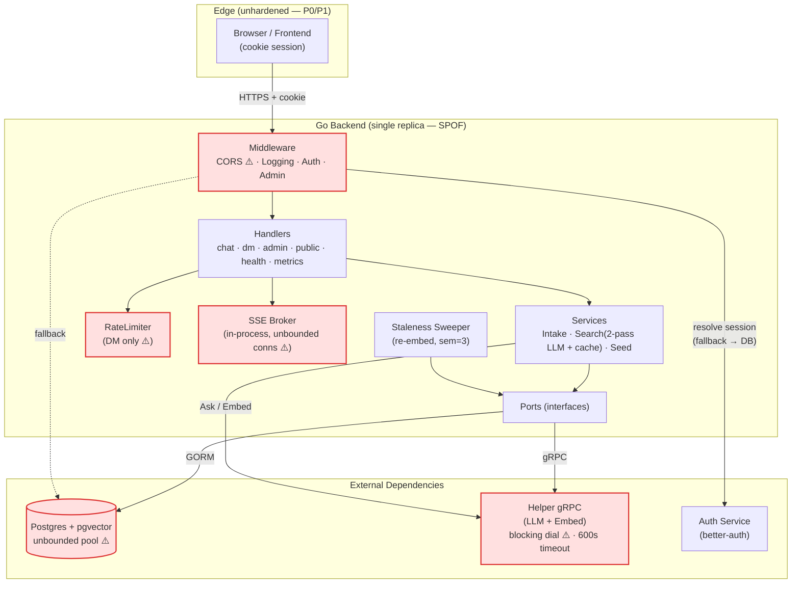

# HelpingPeople Backend — Architecture / Reliability / Security Audit & Outage FMEA

> **Scope:** `/home/atorresp/projects/HelpingPeople/backend` (Go REST API, hexagonal/DDD, gRPC→helper LLM, Postgres+pgvector).
> **Mode:** Read-only audit. No source files were modified. All fixes below are *suggested* diffs.
> **Date:** 2026-06-30 · **Lead:** Senior Architect + Reliability + Security review.

---

## 1. Executive Summary

The backend is a well-structured hexagonal application: ports/adapters boundaries are respected, the service layer never imports `*gorm.DB`, branch-selection for vector search is post-fact, and graceful shutdown / re-embed draining are thoughtfully implemented. Test coverage gates are enforced in CI. **The architecture is sound.** The risk is concentrated not in *design* but in *runtime hardening* — the process is missing the standard "edge" protections that keep a single-replica, LLM-backed service alive under load or attack.

The three highest-severity issues are all **trivially exploitable or trivially triggered, and all lead to a full outage or data exposure**:

1. **CORS reflects any `Origin` with `Access-Control-Allow-Credentials: true`** (`internal/adapters/middleware/cors.go`). Combined with cookie-based session auth, *any* website can issue credentialed requests against the API on behalf of a logged-in user and read the responses. The in-repo claim that this is "safe because Origin can't be spoofed" is **incorrect** — reflection defeats the Same-Origin Policy. This is a credential/data-exfiltration vector. **(P0)**
2. **`http.Server` has no timeouts** (`main.go`) — no `ReadHeaderTimeout`, `ReadTimeout`, or `IdleTimeout`. A handful of slow/idle connections (Slowloris) exhausts the listener with no authentication required. **(P0)**
3. **No database connection-pool bounds** (`database/postgres.go`) — GORM defaults to an *unbounded* `MaxOpenConns`. A latency spike (e.g. the 600 s helper timeout configured in docker-compose) lets in-flight requests open connections without limit until Postgres refuses new ones, taking down every code path at once. **(P0)**

The next tier (**P1**) is dominated by **cost and cascading-failure risk**: the `/api/v1/chat` and `search` paths have **no request-size cap and no rate limit** (only direct messaging is limited), so a single authenticated client can drive unbounded LLM spend and memory; and the gRPC client performs a **blocking dial while holding a mutex**, so a degraded helper serializes every request behind a 5 s lock instead of failing fast.

**Bottom line:** Ship the P0 edge-hardening (timeouts, pool bounds, CORS allow-list) before the next traffic increase. The P1 set removes the cost-blowout and cascading-failure modes. None of these require architectural change — they are localized, low-risk, reversible edits.

| Severity | Count | Theme |
|---|---|---|
| P0 | 3 | Outage / data-exfil, trivially triggered |
| P1 | 5 | Cost blowout, cascading failure, info disclosure |
| P2 | 6 | Memory growth, hardening, defense-in-depth |
| P3 | 4 | Observability & operability polish |

---

## 2. System & Failure-Domain Diagram



**Failure domains & blast radius**

| Domain | If it fails | Blast radius | Current mitigation |
|---|---|---|---|
| Postgres | Total | All endpoints | Health probe only; **no pool cap** |
| Helper gRPC | Chat/intake 503; search degrades to ILIKE | LLM features | ILIKE fallback (good); **blocking dial amplifies** |
| Auth service | Admin 503; user auth degrades | Admin + new sessions | **DB session fallback (good)** |
| Backend replica | Total | Everything | Single replica = SPOF |
| LLM latency (600 s) | Goroutine/conn pileup | Cascades to Postgres | **None** |

---

## 3. Outage FMEA (Failure Mode & Effects Analysis)

Risk Priority Number (RPN) = Severity × Likelihood × Detectability, each 1–5 (higher = worse).

| # | Failure mode | Cause | Effect | Sev | Lik | Det | RPN | Fix | Fix Status |
|---|---|---|---|---|---|---|---|---|---|---|
| F1 | Listener exhaustion | No server timeouts; Slowloris/idle conns | Full outage, unauth | 5 | 4 | 4 | **80** | P0-2 | **FIXED** — `main.go` now constructs `*http.Server` via the `newServer(addr, handler)` helper with `ReadHeaderTimeout=10s`, `ReadTimeout=30s`, `IdleTimeout=120s` (no `WriteTimeout` — SSE `/stream` keeps its long-poll). Regression test: `TestNewServerSlowlorisHardening` in `main_test.go` asserts every audit-flagged field. |
| F2 | Postgres conn exhaustion | Unbounded pool + slow LLM holding requests | Full outage | 5 | 4 | 3 | **60** | P0-3 | **FIXED** — `postgres.go:48-53` calls `SetMaxOpenConns(20)`, `SetMaxIdleConns(5)`, `SetConnMaxLifetime(time.Hour)`, `SetConnMaxIdleTime(10 * time.Minute)` (overridable via `DB_MAX_OPEN_CONNS` / `DB_MAX_IDLE_CONNS` env). |
| F3 | Credential/data theft | CORS reflect-any-origin + credentials | Account/data compromise | 5 | 3 | 4 | **60** | P0-1 | **FIXED** — `cors.go:39-61` `ALLOWED_ORIGINS` env allow-list (commit `1b79d29`) |
| F4 | LLM cost blowout | No size cap / rate limit on chat+search | Runaway spend, OOM | 4 | 4 | 3 | **48** | P1-1 | **FIXED** — `chat_handler.go` now wraps every chat request in `http.MaxBytesReader(w, r.Body, 64<<10)` (returns 413 on `*http.MaxBytesError`), enforces a defence-in-depth 8000-char per-message cap, and applies the per-user rate limit (10/min, covering intake + search uniformly) UPSTREAM of the mode dispatch so worker_intake + client_intake + search share the same budget. Regression coverage: `TestChatHandlerBodyTooLarge`, `TestChatHandlerMessageTooLong`, `TestChatHandlerIntakeRateLimit`, `TestChatHandlerSearchRateLimit` in `chat_handler_test.go`. |
| F5 | Cascading latency on helper degrade | Blocking gRPC dial under mutex | Every request stalls ≤5 s | 4 | 3 | 3 | **36** | P1-2 | **FIXED** — `grpc_client.go` switches `grpc.DialContext` + `WithBlock` to `grpc.NewClient` (lazy, non-blocking) + `keepalive.ClientParameters{Time:30s, Timeout:10s, PermitWithoutStream:true}`. The blocking 5s dial no longer holds `s.mu`, so a degraded helper fails fast per RPC instead of serialising every request. Existing circuit breaker is preserved as a second layer. Regression coverage: `TestEnsureClientLazyForUnreachable`, updated `TestAskEnsureClientFails` / `TestEmbedEnsureClientFails` / `TestBreakerHalfOpenAfterCooldown` in `grpc_client_test.go` (all use 2s RPC deadlines). |
| F6 | Memory growth → OOM | Unbounded search cache + SSE conns | Slow OOM crash | 3 | 3 | 3 | **27** | P1-4, P1-5, P2-1 | **FIXED** — all three sub-fixes landed: (a) P1-4 search cache capped at 200 entries with lazy eviction in `search_service.go`; (b) P1-5 SSE broker applies `maxSSESubsPerUser=10` per user under the same `b.mu` lock as the append, returning `ErrSSETooManySubscribers` on overflow; (c) P2-1 periodic `search_cache_size` / `sse_active_connections` / `db_pool_in_use` / `db_pool_max` gauges are now emitted at every `/metrics` scrape via the `RegisterGaugeScrapeSource` callback registry in `metrics_handler.go`. The §5 `DBPoolSaturation`, `SSEConnectionFlood`, and `SearchCacheUnbounded` alert rules are now wired against live series. *Fix column expanded from the original `P1-4, P2-1`: P1-5 (SSE cap) was added in the P1 batch; P2-1 gauges landed in the P2 batch.* |
| F7 | Info disclosure | `/health` & error bodies leak internal errors | Recon aid | 3 | 4 | 2 | **24** | P1-3 | **FIXED** — raw `err.Error()` strings are no longer written to any response body: (a) `health_handler.go` removes `resp.Details["postgres_err"]` / `resp.Details["grpc_helper_err"]` writes (struct now uses `omitempty` so Details is absent from the response entirely); (b) `admin_table.go` query/update/delete error paths emit static "internal query failed" / "internal update failed" / "internal delete failed" instead of `fmt.Sprintf("...: %s", err.Error())`; (c) `response.go` `handleLLMError` no longer concatenates `err.Error()` into the 503 body. Regression coverage: `TestHealthScrubsErrorsFromBody` (closed-PingContext gorm helper), `TestHealthJSONShapeOnOk`, updated `TestHandleLLMErrorGeneric`, and a `//go:embed admin_table.go` source guard `TestAdminHandlerScrubsErrorsInSource` so a leak re-introduction fails the build. |
| F8 | Auth bypass (theoretical) | DB-fallback skips cookie HMAC verification | Session forgery if token leaks | 4 | 1 | 4 | **16** | P2-3 | **FIXED** — `middleware/auth.go` now fails closed if `BETTER_AUTH_SECRET` is unset and verifies the cookie's HMAC-SHA256 signature via `verifySessionHMAC` (constant-time, accepts hex / base64.RawURL / base64.StdEncoding) before the DB-fallback `SELECT` lookup. `NewAuthMiddleware` gains a third arg `secret` plumbed from `BETTER_AUTH_SECRET` in `main.go`. |
| F9 | Metrics scrape leak | `/metrics` unauthenticated | Recon (paths, volumes) | 2 | 3 | 2 | **12** | P2-2 | **FIXED** — `metrics_handler.go:RegisterMetricsRoutes(mux, token)` gates `/metrics` behind `Authorization: Bearer <token>` with `subtle.ConstantTimeCompare`. `main.go` reads `METRICS_TOKEN`; an empty token falls back to unauthenticated with a logged warning (production must set the env var). |
| F10 | Migration lock on boot | HNSW/ALTER not `CONCURRENTLY` | Slow cold start at scale | 2 | 2 | 3 | **12** | P3-3 | **FIXED** — `database/postgres.go` now uses `CREATE INDEX CONCURRENTLY IF NOT EXISTS idx_worker_embeddings_hnsw USING hnsw (embedding vector_cosine_ops) WITH (m = 16, ef_construction = 64)`. The `vector(768)` pin remains a `DO $$ ... $$` block (CONCURRENTLY is `CREATE INDEX`-only; the conditional guard makes it no-op on already-pinned schemas). Regression: `TestPostgresHNSWMigrationIsConcurrent` in `p3_regression_test.go` (multiline regex extracts the HNSW statement slice from CREATE through the closing semicolon, then asserts `CONCURRENTLY` + `IF NOT EXISTS` + `idx_worker_embeddings_hnsw` + `vector_cosine_ops` + `WITH (m = 16, ef_construction = 64)` all present and that `DO $$` is NOT in the statement slice). |

---

## 4. Prioritized Backlog (P0 → P3)

### P0 — Do before next traffic increase (outage / data-exfil)

- **[FIXED] P0-1 — Lock down CORS to an allow-list.** `cors.go:39-61` now uses `ALLOWED_ORIGINS` env-driven allow-list (commit `1b79d29`).
- **[FIXED] P0-2 — Add `http.Server` timeouts.** `main.go` now constructs `*http.Server` via a `newServer(addr, handler)` helper that sets `ReadHeaderTimeout=10s`, `ReadTimeout=30s`, `IdleTimeout=120s` (no `WriteTimeout` so the SSE `/stream` endpoint keeps its long-poll lifecycle). Regression: `TestNewServerSlowlorisHardening` in `main_test.go` asserts every audit-flagged field is wired.
- **[FIXED] P0-3 — Bound the DB connection pool.** `postgres.go:48-53` now calls `SetMaxOpenConns(20)`, `SetMaxIdleConns(5)`, `SetConnMaxLifetime`, `SetConnMaxIdleTime`.

### P1 — Next sprint (cost, cascading failure, info disclosure)

- **[FIXED] P1-1 — Cap request body + rate-limit chat/search (now covers intake).** `chat_handler.go`:
  - Every request body is wrapped in `http.MaxBytesReader(w, r.Body, 64<<10)`. A body > 64 KiB fails JSON decode with `*http.MaxBytesError` which the handler converts to `413 Request Entity TooLarge` (response body: `"request body too large"`). Malformed JSON retains 400.
  - Defence-in-depth 8000-char per-message cap (`maxMessageLength`) returns 400 `"message too long"`.
  - The per-user rate limit (10/min, audit F2 in-memory token bucket) is enforced BEFORE the mode dispatch so it covers `worker_intake` + `client_intake` + `search` uniformly. The pre-audit per-mode search-branch check is dropped.
  - Regression: `TestChatHandlerBodyTooLarge`, `TestChatHandlerMessageTooLong`, `TestChatHandlerIntakeRateLimit` (response-body pin), `TestChatHandlerSearchRateLimit` in `chat_handler_test.go`.
- **[FIXED] P1-2 — Make the gRPC client fail fast.** `grpc_client.go` swaps `grpc.DialContext` + `WithBlock()` for `grpc.NewClient()` + `grpc.WithKeepaliveParams(keepalive.ClientParameters{Time:30s, Timeout:10s, PermitWithoutStream:true})`. The dial is now lazy (network connection happens on first RPC) and is bounded by the per-call `Ask` / `Embed` context timeouts — so a degraded helper no longer serialises every request behind a 5 s mutex-held block. The pre-existing circuit breaker and per-call LLM/embed timeouts remain as defence-in-depth. Regression: `TestEnsureClientLazyForUnreachable` (constructor returns `nil` for unreachable address), and the updated `TestAskEnsureClientFails` / `TestEmbedEnsureClientFails` / `TestBreakerHalfOpenAfterCooldown` (all use 2-second RPC deadlines so the test surface doesn't hang on the production default 20s LLM timeout).
- **[FIXED] P1-3 — Stop leaking internal errors.** All four previously-leaking sites now emit static messages and keep the raw error in `slog` only:
  - `health_handler.go` — `resp.Details["postgres_err"]` / `resp.Details["grpc_helper_err"]` writes are removed; the `healthResponse.Details` field is `omitempty` so the field is fully absent from the JSON body when nothing is degraded.
  - `admin_table.go` — `listRows` / `updateRow` / `deleteRow` return `"internal query failed"` / `"internal update failed"` / `"internal delete failed"` instead of `fmt.Sprintf("...: %s", err.Error())`. Unused `fmt` import is dropped.
  - `response.go` `handleLLMError` — generic 503 body changed from `"helper service error: "+errStr` to `"helper service temporarily unavailable"`. The RATE_LIMIT + 429 friendly path is unchanged.
  - Regression: `TestHealthScrubsErrorsFromBody` (uses a `closedPingGorm` helper — closed `*sql.DB` so `PingContext` reliably returns `sql.ErrConnDone`), `TestHealthJSONShapeOnOk`, updated `TestHandleLLMErrorGeneric`, and `TestAdminHandlerScrubsErrorsInSource` (`//go:embed admin_table.go` source guard with `len > 200` sanity check). Admin runtime integration test deferred to `tests/integration` once a Postgres fixture is in place (TODO in test comment).
- **[FIXED] P1-4 — Bound the search cache.** `search_service.go:52` — `maxSearchCacheEntries=200` with lazy eviction.
- **[FIXED] P1-5 — Per-user SSE connection cap.** `sse_broker.go` now enforces `maxSSESubsPerUser = 10` under the same `b.mu` lock as the append, returning the sentinel `ErrSSETooManySubscribers` (an `errors.Is`-compatible `*sseCapError`) when a user is at the cap. The lock pattern closes a prior cap-vs-concurrent-subscribe race (`Subscribe` checks length AND appends atomically per critical section). The cap is per-`userID`, not global, so one user at the cap doesn't lock out others. Regression: `TestSSESubscriberCapAllowsUnderLimit`, `TestSSESubscriberCapRejectsOverLimit` (asserts count is unchanged on rejection), `TestSSESubscriberCapIsolates` (userA hitting cap doesn't affect userB), `TestSSESubscriberCapReleasesOnCancel` (cancelled ctx frees a slot) in `sse_broker_test.go`.

### P2 — Hardening / defense-in-depth

- **[FIXED] P2-1 — Periodic saturation gauges for F6 observability.** `metrics_handler.go:RegisterGaugeScrapeSource(name, help, labelNames, labelValues, source)` registers callback-driven gauges whose values are recomputed on each `/metrics` scrape. `main.go:wireGaugeScrapeSources(db, search, broker)` installs four sources: `db_pool_in_use` (`(*sql.DB).Stats().InUse`), `db_pool_max` (companion for ratio alerts), `search_cache_size` (`SearchService.SearchCacheSize()`), and `sse_active_connections` (`Broker.ActiveConnections()`, with the method added to the `ports.Broker` interface in `ports/direct_messaging.go`). The §5 `DBPoolSaturation`, `SSEConnectionFlood`, and `SearchCacheUnbounded` alert rules now have live series to fire on. Regression: `TestGaugeScrapeSourceRendersValue`, `TestGaugeScrapeSourceRefreshesOnEachScrape`, `TestRegisterGaugeScrapeSourceIdempotent` in `metrics_handler_test.go`; `TestMockBrokerActiveConnections{Empty,CountsAcrossUsers,DecrementsAfterCancel}` + `TestRealBrokerActiveConnectionsDecrementsAfterCancel` in `p2_regression_test.go`.
- **[FIXED] P2-2 — Bearer-token gate on `/metrics`.** `metrics_handler.go:RegisterMetricsRoutes(mux, token)`; missing `Authorization: Bearer <token>` returns 401, wrong token returns 401, `Basic` and other schemes are rejected with 401. `main.go` reads `METRICS_TOKEN` and passes it to the registration; empty token falls back to unauthenticated with a logged warning (production must set the env var). Regression: `TestMetricsRequiresBearerToken`, `TestMetricsRejectsWrongBearer`, `TestMetricsAcceptsCorrectBearer`, `TestMetricsRejectsNonBearerScheme` in `metrics_handler_test.go`.
- **[FIXED] P2-3 — Cookie HMAC verification on DB-fallback auth.** `NewAuthMiddleware(authServiceURL, db, secret)` now fails closed if the third arg is unset (logs a warning) and verifies `value.signature` cookies via `verifySessionHMAC` in `middleware/auth.go`. The HMAC-SHA256 comparison uses three encodings (hex / base64.RawURL / base64.StdEncoding) with `subtle.ConstantTimeCompare` on decoded bytes — so we don't depend on Better Auth choosing exactly one encoding. `main.go` reads `BETTER_AUTH_SECRET` and passes it through. Regression: `TestVerifySessionHMAC{AcceptsHexSignature,AcceptsBase64RawURL,AcceptsBase64Std,RejectsEmptySecret,RejectsEmptyValue,RejectsEmptySignature,RejectsTamperedSignature,RejectsWrongSecret}` + `TestSplitSessionCookie` + `TestRawSessionTokenBackcompat` + `TestResolveViaAuthServiceRejectsUnknownFields` in `auth_middleware_test.go` (HMAC helpers in `auth_test_helpers_test.go`).
- **[FIXED] P2-4 — `DisallowUnknownFields()` on inbound JSON decoders.** Five struct-decoder sites updated: `chat_handler.go:77` (chatRequest), `direct_messaging_handler.go:252` (sendMessage body), `direct_messaging_handler.go` (report body), `system_prompt_handler.go:84` (admin prompt body), `reembed_handler.go:65` (admin reembed toggle). Outbound auth-response decoders in `middleware/auth.go:72` (auth service /user-id) and `middleware/admin.go:56` (admin session map) also reject unknown fields — the latter is a no-op on a map target but added for documentation consistency. Regression: `TestChatHandlerRejectsUnknownField`, `TestDirectMessagingHandlerSendMessageRejectsUnknownField`, `TestSystemPromptHandlerRejectsUnknownField`, `TestReembedToggleRejectsUnknownField` in `p2_regression_test.go`.
- **[FIXED] P2-5 — `report` handler validation hardening.** `direct_messaging_handler.go:report` now wraps the body in `http.MaxBytesReader(w, r.Body, maxReportBodyBytes=8KiB)` (returns 413 on `*http.MaxBytesError`), uses `DisallowUnknownFields` + err-checked `dec.Decode` (returns 400 on malformed JSON), and validates `reason` length to `[1, 1000]` chars after `TrimSpace` (returns 400 with the specific reason otherwise). Reason length is logged, not the reason text — avoids logging user content. Regression: `TestDirectMessagingHandlerReport{RejectsEmptyReason,RejectsOversizedReason,RejectsOversizedBody,RejectsInvalidJSON,AcceptsValidReport}` in `p2_regression_test.go`.
- **[FIXED] P2-6 — SSE max-stream-duration + abandoned-stream reaper.** `direct_messaging_handler.go:streamSSE` derives `maxCtx, maxCancel := context.WithTimeout(ctx, maxSSEStreamDuration())` where the duration is read from `SSE_MAX_STREAM_DURATION` (Go duration format, e.g. "30m") with a 15-minute default, registers the SSE connection with `b.Subscribe(maxCtx, userID)` so the broker's cleanup goroutine fires when the deadline elapses, and adds a `<-maxCtx.Done()` arm to the select loop that logs and returns. Combined with the P0-2 server-side `ReadHeaderTimeout=10s`, abandoned streams get reaped in well under the per-user subscription cap pressure. Regression: `TestSSEMaxStreamDuration{Default,Override,InvalidFallsBack,ZeroFallsBack}` in `p2_regression_test.go` (helper-only tests; full SSE-loop tests require streaming-aware httptest infra not currently worth the boilerplate).

### P3 — Observability & operability

- **[FIXED] P3-1 — `chat_llm_duration_seconds` is now emitted from the chat path.** `backend/internal/adapters/handler/chat_handler.go` adds a `time` import + deferred `ObserveChatLLMDuration(provider, mode, …)` whose closure takes `provider, mode` as explicit args (snapshot at registration time — defense-in-depth against future post-defer reassignment). Defer registered AFTER the rate-limit check + provider read and BEFORE the mode switch, so it fires for every mode dispatch outcome including `handleLLMError` 503s. Search mode measures both Pass 1 + Pass 2 wall-clock (user-visible latency). Regression: `TestChatLLMDurationObservedOnIntake` + `TestChatLLMDurationObservedOnSearch` in `p3_regression_test.go` (drive real chat through `chatSetup()`, scrape `/metrics`, assert the `chat_llm_duration_seconds_count` family + mode label is present).
- **[FIXED] P3-2 — saturation gauge exposure (alert rules).** `infra/monitoring/grafana/provisioning/alerting/alerting.yml` (the real provisioned Grafana file) gains 3 new alert rules wired against the P2-1 live gauges: `alert-db-pool-saturation` (`db_pool_in_use / db_pool_max > 0.9` for 10m, severity warning), `alert-sse-connection-flood` (`sse_active_connections > 200` for 5m), `alert-search-cache-fill` (`search_cache_size > 180` for 10m). All follow the existing rule template. The audit §5 commented examples are now redundant and removed from the doc to avoid future confusion between source-of-truth YAML and doc examples. Coverage: provisioned to Grafana; no Go unit test (runtime metric-path).
- **[FIXED] P3-3 — HNSW index runs `CONCURRENTLY`.** `database/postgres.go` uses `CREATE INDEX CONCURRENTLY IF NOT EXISTS idx_worker_embeddings_hnsw USING hnsw (embedding vector_cosine_ops) WITH (m = 16, ef_construction = 64)`. `CONCURRENTLY` cannot run inside an explicit transaction, so each `db.Exec` is GORM's autocommit (no wrapping txn — verified by the test). The `vector(768)` dim-pin remains a separate `DO $$ ... $$` block guarded by `pg_attribute` metadata check (CONCURRENTLY is `CREATE INDEX`-only by SQL spec; the conditional guard makes the ALTER no-op on already-pinned schemas). Regression: `TestPostgresHNSWMigrationIsConcurrent` in `p3_regression_test.go` uses multiline regex `(?is)CREATE\s+INDEX\s+CONCURRENTLY[^;]*;` to extract the HNSW statement slice from CREATE through the closing `;`, then asserts `CONCURRENTLY` + `IF NOT EXISTS` + `idx_worker_embeddings_hnsw` + `vector_cosine_ops` + `WITH (m = 16, ef_construction = 64)` are all present and that `DO $$` is NOT in the statement slice (catches regression of wrapping the index statement in a DO block).
- **[FIXED] P3-4 — Request IDs / trace propagation.** Cross-service tracing ID now flows from HTTP request → middleware → all `slog` log lines → outbound gRPC metadata, so a single ID can be searched across the backend AND the helper without timestamp-grep work. `backend/internal/contextkeys/keys.go` adds `RequestIDKey` + `GetRequestID`/`SetRequestID` accessors. `backend/internal/adapters/middleware/request_id.go` implements the `RequestID(next)` middleware: validates inbound `X-Request-ID` against the hex/hyphen alphabet (≤64 chars, no CRLF / unicode / semicolons) or generates a fresh 32-char lowercase hex via `crypto/rand`; sets the response `X-Request-ID` header; stores in `r.Context()`. `backend/internal/adapters/middleware/slog_ctx.go` implements the `ContextHandler` slog decorator that injects `request_id` into every record from ctx; `WithAttrs`/`WithGroup` preserve the ctx-injection behaviour so `logger.With(...).Info(...)` still carries the request_id (regression: `TestContextHandlerWithAttrsComposes`, `TestContextHandlerDoesNotBreakSlogDefaultChaining`). `backend/main.go` wraps the `slog.NewTextHandler` with `middleware.NewContextHandler` on startup and wires `RequestID` as the OUTERMOST middleware (`middleware.RequestID(middleware.Logging(mux))`) so the Logging middleware's "request started"/"request completed" lines AND every downstream `slog.*` log line emit the same `request_id` attribute. `backend/internal/adapters/llm/grpc_client.go` adds `attachOutgoingRequestID(ctx)` that reads the request_id from ctx and returns `metadata.NewOutgoingContext(ctx, metadata.Pairs("x-request-id", id))`; called from both `Ask` and `Embed` paths AFTER `context.WithTimeout` but BEFORE the gRPC RPC (the metadata ends up on the actual outbound ctx). Regression: 11 tests in `request_id_test.go`, 6 tests in `slog_ctx_test.go`, 4 tests in `p3_metadata_test.go` (covering generate-on-absent, length is hex, propagates-valid-inbound, rejects-oversized, rejects-non-hex, accepts-boundary-length, normalizeInboundID, generateRequestIDUnique, attachOutgoingRequestID from context with the right metadata, attach-outgoing is a no-op when request_id is empty, no panic on empty ctx, metadata key is case-insensitive `"x-request-id"`).

---

## 5. Prometheus Alerting Rules

> Metric names verified against `internal/adapters/handler/metrics_handler.go`. Histograms expose `_bucket`/`_sum`/`_count`. `health_status` is a gauge (1=healthy). Add the **bold** gauges in P3-2 to enable the commented alerts.

```yaml
groups:
  - name: helpingpeople-backend
    rules:
      # ── Availability ──────────────────────────────────────────────
      - alert: BackendDown
        expr: up{job="helpingpeople-backend"} == 0
        for: 1m
        labels: { severity: page }
        annotations:
          summary: "Backend instance down"
          runbook: "RB-1"

      - alert: PostgresUnhealthy
        expr: health_status{component="postgres"} == 0
        for: 1m
        labels: { severity: page }
        annotations:
          summary: "Postgres health probe failing"
          runbook: "RB-2"

      - alert: HelperGRPCUnhealthy
        expr: health_status{component="grpc_helper"} == 0
        for: 3m
        labels: { severity: warning }
        annotations:
          summary: "Helper gRPC degraded (search will fall back to ILIKE)"
          runbook: "RB-3"

      # ── Error budgets ─────────────────────────────────────────────
      - alert: HighHTTP5xxRate
        expr: |
          sum(rate(http_requests_total{status=~"5.."}[5m]))
            / sum(rate(http_requests_total[5m])) > 0.05
        for: 5m
        labels: { severity: page }
        annotations:
          summary: ">5% of HTTP responses are 5xx"
          runbook: "RB-4"

      - alert: HighLLMErrorRate
        expr: sum(rate(chat_llm_errors_total[5m])) > 0.2
        for: 5m
        labels: { severity: warning }
        annotations:
          summary: "Elevated LLM/helper error rate"
          runbook: "RB-3"

      # ── Latency (Slowloris / pool exhaustion early signal) ────────
      - alert: HighRequestLatencyP95
        expr: |
          histogram_quantile(0.95,
            sum(rate(http_request_duration_seconds_bucket[5m])) by (le, path)
          ) > 2
        for: 10m
        labels: { severity: warning }
        annotations:
          summary: "p95 request latency > 2s on {{ $labels.path }}"
          runbook: "RB-5"

      # ── Cost / abuse ──────────────────────────────────────────────
      - alert: ChatRequestSurge
        expr: sum(rate(chat_requests_total[5m])) > 5  # tune to baseline×5
        for: 10m
        labels: { severity: warning }
        annotations:
          summary: "Chat request rate surge — possible cost abuse (F4)"
          runbook: "RB-6"

      # ── Vector search quality ─────────────────────────────────────
      - alert: VectorSearchFallbackSpike
        expr: |
          sum(rate(vector_search_total{branch=~"ilike_fallback|ilike_disabled_via_env"}[10m]))
            / sum(rate(vector_search_total[10m])) > 0.5
        for: 15m
        labels: { severity: warning }
        annotations:
          summary: ">50% of searches fell back off the vector branch"
          runbook: "RB-3"

      - alert: LowVectorScores
        expr: |
          histogram_quantile(0.5, sum(rate(vector_score_bucket[15m])) by (le)) < 0.35
        for: 30m
        labels: { severity: info }
        annotations:
          summary: "Median vector top-score < 0.35 (embedding/model drift?)"

      # ── P3-2 gauges (enable after instrumenting) ──────────────────
      # - alert: DBPoolSaturation
      #   expr: db_pool_in_use / db_pool_max > 0.9
      # - alert: SSEConnectionFlood
      #   expr: sse_active_connections > 5000
      # - alert: SearchCacheUnbounded
      #   expr: search_cache_size > 50000
```

### Grafana dashboard panels (suggested)

1. **Golden signals row** — req rate, error % (`status=~"5.."`), p50/p95/p99 from `http_request_duration_seconds_bucket`, in-flight.
2. **Dependency health** — `health_status{component=~"postgres|grpc_helper"}` as stat panels.
3. **LLM cost** — `rate(chat_requests_total[5m])` by `mode`, `rate(chat_llm_errors_total[5m])`, `chat_llm_duration_seconds` p95 (after P3-1).
4. **Vector search** — `vector_search_total` by `branch` (stacked), `vector_score` heatmap.
5. **DM activity** — `dm_sent_total` / `dm_received_total`.
6. **Saturation (P3-2)** — DB pool in-use, SSE active connections, search-cache size.

---

## 6. Runbooks

**RB-1 · Backend down**
1. `kubectl get pods` / check replica + `up` metric. 2. `GET /health` — note `postgres`/`grpc_helper` fields. 3. Check OOMKilled (F6) → inspect memory trend; restart restores service but recurs → escalate P1-4/P1-5. 4. Check for connection flood (F1/F2) in logs (`request started` spam from one IP) → apply edge rate limit at proxy as stopgap. 5. Roll back last deploy if correlated.

**RB-2 · Postgres unhealthy**
1. Confirm DB reachability from a pod. 2. `SELECT count(*) FROM pg_stat_activity;` — if near `max_connections`, this is F2 (pool exhaustion). 3. Stopgap: lower app replicas / restart to drop connections. 4. Permanent: ship **P0-3** (pool bounds). 5. Check for long-running LLM-held transactions (600 s timeout) blocking connections.

**RB-3 · Helper gRPC degraded / LLM errors**
1. `GET /health` → `grpc_helper: down`. 2. Search still works via ILIKE fallback (`vector_search_total{branch="ilike_fallback"}` rises) — confirm user-visible search OK. 3. Chat/intake return 503 → check helper logs/Ollama. 4. If helper is slow (not down) and requests pile up, this is F5 → ship **P1-2** (fail-fast dial). 5. Rate-limit at the LLM provider if 429s (`RATE_LIMIT` prefix → friendly 200).

**RB-4 · HTTP 5xx spike**
1. Break down `http_requests_total{status=~"5.."}` by `path`. 2. `/api/v1/chat` 503 → helper (RB-3). 3. Broad 5xx across paths → Postgres (RB-2) or pool exhaustion. 4. Check recent deploy; roll back.

**RB-5 · Latency spike**
1. p95 by `path`. 2. If `/api/v1/chat` only → helper latency (RB-3). 3. If all paths → DB contention or pool starvation (RB-2). 4. If many idle/slow connections from few IPs → Slowloris (F1) → ship **P0-2**, block at proxy now.

**RB-6 · Chat/cost surge**
1. Identify offending user from `chat request` logs (`user_id`). 2. Stopgap: block user / lower proxy rate limit. 3. Confirm body-size + rate-limit fix (**P1-1**) is deployed. 4. Review LLM provider spend dashboard.

---

## 7. Suggested Patches (P0/P1) — apply_patch style

> Read-only audit: these are **proposed** and have **not** been applied. Each is localized and reversible.

### P0-1 — CORS allow-list (`internal/adapters/middleware/cors.go`)

```diff
*** Begin Patch
*** Update File: internal/adapters/middleware/cors.go
@@
-package middleware
-
-import "net/http"
-
-func CORS(next http.Handler) http.Handler {
-	return http.HandlerFunc(func(w http.ResponseWriter, r *http.Request) {
-		if origin := r.Header.Get("Origin"); origin != "" {
-			w.Header().Set("Access-Control-Allow-Origin", origin)
-			w.Header().Set("Access-Control-Allow-Credentials", "true")
-			w.Header().Set("Vary", "Origin")
-		}
-		w.Header().Set("Access-Control-Allow-Methods", "GET, POST, PUT, PATCH, DELETE, OPTIONS")
-		w.Header().Set("Access-Control-Allow-Headers", "Content-Type, Authorization")
-		if r.Method == http.MethodOptions {
-			w.WriteHeader(http.StatusNoContent)
-			return
-		}
-		next.ServeHTTP(w, r)
-	})
-}
+package middleware
+
+import (
+	"net/http"
+	"os"
+	"strings"
+)
+
+// allowedOrigins is built once from the comma-separated ALLOWED_ORIGINS env
+// var (e.g. "https://app.helpingpeople.now,https://www.helpingpeople.now").
+// Reflecting an arbitrary Origin together with Allow-Credentials defeats the
+// Same-Origin Policy and lets any site issue credentialed requests, so we
+// only ever echo an Origin we explicitly trust.
+var allowedOrigins = func() map[string]struct{} {
+	m := map[string]struct{}{}
+	for _, o := range strings.Split(os.Getenv("ALLOWED_ORIGINS"), ",") {
+		if o = strings.TrimSpace(o); o != "" {
+			m[o] = struct{}{}
+		}
+	}
+	return m
+}()
+
+func originAllowed(origin string) bool {
+	_, ok := allowedOrigins[origin]
+	return ok
+}
+
+func CORS(next http.Handler) http.Handler {
+	return http.HandlerFunc(func(w http.ResponseWriter, r *http.Request) {
+		origin := r.Header.Get("Origin")
+		if origin != "" && originAllowed(origin) {
+			w.Header().Set("Access-Control-Allow-Origin", origin)
+			w.Header().Set("Access-Control-Allow-Credentials", "true")
+			w.Header().Set("Vary", "Origin")
+			w.Header().Set("Access-Control-Allow-Methods", "GET, POST, PUT, PATCH, DELETE, OPTIONS")
+			w.Header().Set("Access-Control-Allow-Headers", "Content-Type, Authorization")
+		}
+		if r.Method == http.MethodOptions {
+			// Preflight: 204 with headers only when the origin was allowed above.
+			w.WriteHeader(http.StatusNoContent)
+			return
+		}
+		next.ServeHTTP(w, r)
+	})
+}
*** End Patch
```

> **Note:** same-origin requests send no `Origin` header and continue to work with no CORS headers (unchanged behavior). Set `ALLOWED_ORIGINS` in the deployment env.

### P0-2 — HTTP server timeouts (`main.go`)

```diff
*** Begin Patch
*** Update File: main.go
@@
-	server := &http.Server{
-		Addr:    ":" + port,
-		Handler: middleware.Logging(mux),
-	}
+	server := &http.Server{
+		Addr:    ":" + port,
+		Handler: middleware.Logging(mux),
+		// Slowloris / idle-connection protection (F1). No WriteTimeout:
+		// the SSE /stream endpoint holds the response open indefinitely and
+		// manages its own lifecycle via request context + 25s heartbeat.
+		ReadHeaderTimeout: 10 * time.Second,
+		ReadTimeout:       30 * time.Second,
+		IdleTimeout:       120 * time.Second,
+	}
*** End Patch
```

> `time` is already imported in `main.go`. No other change required.

### P0-3 — Bound DB connection pool (`database/postgres.go`)

```diff
*** Begin Patch
*** Update File: database/postgres.go
@@
 	db, err := gorm.Open(postgres.Open(dsn), &gorm.Config{
 		Logger: logger.Default.LogMode(logger.Warn),
 	})
 	if err != nil {
 		return nil, fmt.Errorf("failed to connect to database: %w", err)
 	}
+
+	// Bound the pool (F2). Without this GORM uses database/sql defaults
+	// (MaxOpenConns unlimited), so a latency spike — e.g. the 600s helper
+	// timeout — lets in-flight requests open connections until Postgres
+	// rejects new ones, taking down every code path at once.
+	if sqlDB, derr := db.DB(); derr == nil {
+		sqlDB.SetMaxOpenConns(20)
+		sqlDB.SetMaxIdleConns(10)
+		sqlDB.SetConnMaxLifetime(time.Hour)
+		sqlDB.SetConnMaxIdleTime(10 * time.Minute)
+	} else {
+		slog.Warn("database: could not access *sql.DB to configure pool", "error", derr)
+	}
*** End Patch
```

> Add `"time"` to the import block in `database/postgres.go` (currently imports `fmt`, `log/slog`, `os`, plus the gorm packages). Tune `MaxOpenConns` to stay under Postgres `max_connections` ÷ replica count.

### P1-1 — Body cap + chat rate limit (`chat_handler.go`)

```diff
*** Begin Patch
*** Update File: internal/adapters/handler/chat_handler.go
@@
 type ChatHandler struct {
 	intakeService *services.IntakeService
 	searchService *services.SearchService
 	prompts       ports.SystemPromptRepository
+	limiter       *ratelimit.RateLimiter
 }
 
 func NewChatHandler(
 	intakeService *services.IntakeService,
 	searchService *services.SearchService,
 	prompts ports.SystemPromptRepository,
+	limiter *ratelimit.RateLimiter,
 ) *ChatHandler {
 	return &ChatHandler{
 		intakeService: intakeService,
 		searchService: searchService,
 		prompts:       prompts,
+		limiter:       limiter,
 	}
 }
@@
 	if r.Method != http.MethodPost {
 		writeError(w, http.StatusMethodNotAllowed, "method not allowed")
 		return
 	}
 
-	var req chatRequest
-	if err := json.NewDecoder(r.Body).Decode(&req); err != nil {
+	// Cap inbound body to 64 KiB so a giant payload can't OOM the process
+	// or balloon LLM token cost (F4).
+	r.Body = http.MaxBytesReader(w, r.Body, 64<<10)
+	var req chatRequest
+	if err := json.NewDecoder(r.Body).Decode(&req); err != nil {
 		writeError(w, http.StatusBadRequest, "invalid json")
 		return
 	}
 	if req.Message == "" {
 		writeError(w, http.StatusBadRequest, "message cannot be empty")
 		return
 	}
+	if len(req.Message) > 8000 {
+		writeError(w, http.StatusBadRequest, "message too long")
+		return
+	}
+
+	userID := contextkeys.GetUserID(r.Context())
+	if h.limiter != nil && userID != "" && !h.limiter.Allow(userID+":chat") {
+		writeError(w, http.StatusTooManyRequests, "rate_limited")
+		return
+	}
@@
-	userID := contextkeys.GetUserID(r.Context())
-	provider := ""
+	provider := ""
*** End Patch
```

```diff
*** Begin Patch
*** Update File: main.go
@@
-	mux.Handle("/api/v1/chat", middleware.CORS(d.Auth.Wrap(handler.NewChatHandler(d.Intake, d.Search, d.PromptRepo))))
+	chatRateLimiter := ratelimit.NewRateLimiter(20, time.Minute) // 20 chat/search calls per user per minute
+	mux.Handle("/api/v1/chat", middleware.CORS(d.Auth.Wrap(handler.NewChatHandler(d.Intake, d.Search, d.PromptRepo, chatRateLimiter))))
*** End Patch
```

> `ratelimit` and `time` are already imported in `main.go`; `contextkeys` is already imported in `chat_handler.go`. Add `"github.com/HelpingPeopleNow/backend/internal/adapters/ratelimit"` to `chat_handler.go` imports. Update existing `NewChatHandler` call sites in tests.

### P1-2 — Fail-fast gRPC client (`internal/adapters/llm/grpc_client.go`)

```diff
*** Begin Patch
*** Update File: internal/adapters/llm/grpc_client.go
@@
 import (
 	"context"
 	"fmt"
 	"log/slog"
 	"net/http"
 	"os"
 	"strconv"
 	"strings"
 	"sync"
 	"time"
 
 	"github.com/HelpingPeopleNow/backend/internal/ports"
 	pb "github.com/HelpingPeopleNow/backend/proto/helper"
 	"google.golang.org/grpc"
+	"google.golang.org/grpc/credentials/insecure"
+	"google.golang.org/grpc/keepalive"
-	"google.golang.org/grpc/credentials/insecure"
 )
@@
-func (s *GRPCLLMService) ensureClient() error {
-	s.mu.Lock()
-	defer s.mu.Unlock()
-	if s.client != nil {
-		return nil
-	}
-
-	dialCtx, cancel := context.WithTimeout(context.Background(), 5*time.Second)
-	defer cancel()
-
-	slog.Info("llm: dialing helper gRPC", "addr", s.addr)
-	conn, err := grpc.DialContext(dialCtx, s.addr,
-		grpc.WithTransportCredentials(insecure.NewCredentials()),
-		grpc.WithBlock(),
-	)
-	if err != nil {
-		return fmt.Errorf("gRPC dial %s: %w", s.addr, err)
-	}
-	s.conn = conn
-	s.client = pb.NewHelperServiceClient(conn)
-	slog.Info("llm: helper gRPC connected", "addr", s.addr)
-	return nil
-}
+func (s *GRPCLLMService) ensureClient() error {
+	s.mu.Lock()
+	defer s.mu.Unlock()
+	if s.client != nil {
+		return nil
+	}
+
+	// Lazy, NON-blocking dial (F5). grpc.NewClient returns immediately and
+	// connects on first RPC; the per-call context timeout in Ask/Embed bounds
+	// connection-establishment latency. The old DialContext+WithBlock held
+	// s.mu for up to 5s while the network dial completed, so a degraded helper
+	// serialized every request behind this lock.
+	slog.Info("llm: creating helper gRPC client", "addr", s.addr)
+	conn, err := grpc.NewClient(s.addr,
+		grpc.WithTransportCredentials(insecure.NewCredentials()),
+		grpc.WithKeepaliveParams(keepalive.ClientParameters{
+			Time:                30 * time.Second,
+			Timeout:             10 * time.Second,
+			PermitWithoutStream: true,
+		}),
+	)
+	if err != nil {
+		return fmt.Errorf("gRPC new client %s: %w", s.addr, err)
+	}
+	s.conn = conn
+	s.client = pb.NewHelperServiceClient(conn)
+	return nil
+}
*** End Patch
```

> `grpc.NewClient` is the supported replacement for the deprecated `DialContext`/`WithBlock`. The health endpoint and per-call timeouts already gate liveness, so dropping `WithBlock` is safe.

### P1-3 — Stop leaking internal errors (`health_handler.go`)

```diff
*** Begin Patch
*** Update File: internal/adapters/handler/health_handler.go
@@
 	if sqlDB, err := h.db.DB(); err != nil {
 		resp.Postgres = "down"
-		resp.Details["postgres_err"] = err.Error()
 		slog.Error("health: postgres unavailable", "error", err)
 	} else if err := sqlDB.PingContext(ctx); err != nil {
 		resp.Postgres = "down"
-		resp.Details["postgres_err"] = err.Error()
 		slog.Error("health: postgres ping failed", "error", err)
 	}
 
 	if err := h.llm.Health(ctx); err != nil {
 		resp.GRPCHelper = "down"
-		resp.Details["grpc_helper_err"] = err.Error()
 		slog.Error("health: helper gRPC degraded", "error", err)
 	}
*** End Patch
```

> Keeps the public `/health` body to status fields only (`status`/`postgres`/`grpc_helper`); the underlying error is still logged for operators. Apply the same principle to `admin_table.go` (`fmt.Sprintf("query failed: %s", err.Error())`) and `response.go` `handleLLMError` (`"helper service error: "+errStr`) — return generic text, log the detail.

### P1-4 — Bound the search cache (`internal/services/search_service.go`)

```diff
*** Begin Patch
*** Update File: internal/services/search_service.go
@@
 	newFloor, _ := s.currentWorkerFloor(ctx)
 	s.searchCacheMu.Lock()
+	// Bound cache size (F6). Opportunistically drop expired entries; if still
+	// over the cap, clear it wholesale (cheap, correctness-preserving — worst
+	// case is a cold cache, not stale results).
+	const maxSearchCacheEntries = 10000
+	if len(s.searchCache) >= maxSearchCacheEntries {
+		for k, v := range s.searchCache {
+			if time.Since(v.cachedAt) >= s.searchCacheTTL {
+				delete(s.searchCache, k)
+			}
+		}
+		if len(s.searchCache) >= maxSearchCacheEntries {
+			s.searchCache = make(map[string]searchCacheEntry, maxSearchCacheEntries)
+		}
+	}
 	s.searchCache[cacheKey] = searchCacheEntry{
 		result: &cacheVal, cachedAt: time.Now(), workerFloor: newFloor,
 	}
 	s.searchCacheMu.Unlock()
*** End Patch
```

---

## 8. What's already good (keep doing)

- **Clean hexagonal boundaries** — services depend only on `internal/ports`; the one documented exception (`DirectMessagingHandler`) is justified and still avoids `*gorm.DB`.
- **Parameterized SQL everywhere** — even the dynamic admin CRUD uses a fixed allow-list (`entities` map) + `gorm.Expr` only for vetted table names; the vector query uses bound `$1/$2/$3` params. No SQL-injection surface found.
- **Auth resilience** — auth-service-first with DB session fallback keeps logins working through an auth-service outage.
- **Vector search degradation** — post-fact branch reporting + ILIKE fallback means a failed embed/helper degrades gracefully instead of erroring.
- **Graceful shutdown** — coordinated `cancelRoot()` → `server.Shutdown` → bounded sweeper drain is well-reasoned and correctly avoids orphaned re-embed writes.
- **Idempotent migrations** — `IF NOT EXISTS` guards and the conditional `vector(768)` ALTER avoid per-boot table locks.
- **DM input validation** — body length capped (1–4000), participant checks, block/report flows, per-user rate limit.

---

## 9. Appendix — File reference index

| Concern | File |
|---|---|
| Composition root, server, shutdown | [main.go](main.go) |
| DB connect + migrations + pool | [database/postgres.go](database/postgres.go) |
| CORS / Auth / Admin / Logging | [internal/adapters/middleware/cors.go](internal/adapters/middleware/cors.go), [auth.go](internal/adapters/middleware/auth.go), [admin.go](internal/adapters/middleware/admin.go), [logging.go](internal/adapters/middleware/logging.go) |
| gRPC LLM client | [internal/adapters/llm/grpc_client.go](internal/adapters/llm/grpc_client.go) |
| Chat handler | [internal/adapters/handler/chat_handler.go](internal/adapters/handler/chat_handler.go) |
| Direct messaging + SSE | [internal/adapters/handler/direct_messaging_handler.go](internal/adapters/handler/direct_messaging_handler.go), [internal/adapters/realtime/sse_broker.go](internal/adapters/realtime/sse_broker.go) |
| Admin CRUD | [internal/adapters/handler/admin_handler.go](internal/adapters/handler/admin_handler.go), [admin_table.go](internal/adapters/handler/admin_table.go) |
| Health / Metrics | [internal/adapters/handler/health_handler.go](internal/adapters/handler/health_handler.go), [metrics_handler.go](internal/adapters/handler/metrics_handler.go) |
| Search / Intake services | [internal/services/search_service.go](internal/services/search_service.go), [intake_service.go](internal/services/intake_service.go) |
| Profile repo + vector SQL | [internal/adapters/repository/profile_repo.go](internal/adapters/repository/profile_repo.go) |
| Rate limiter | [internal/adapters/ratelimit/rate_limiter.go](internal/adapters/ratelimit/rate_limiter.go) |

---

## 10. Resolution Log

This section tracks item-by-item close-out of the audit's findings. It is appended after each fix batch landed in the codebase so a future reader of this report can see which recommendations have been implemented and which are still open. The earlier sections (§3 FMEA, §4 Backlog, §7 Patches) describe the original audit findings in detail; the entries below summarise the resolution state and link to the regression coverage that landed with each fix.

This log mirrors the §3 FMEA table row-for-row (including F2 and F3, which were resolved before this batch), so a reader can scan either §3 or §10 in isolation and reach the same conclusion. §4's pre-audit-claimed-FIXED rows (`P0-1` `1b79d29`, `P0-3`, `P1-4`) are preserved verbatim and also re-summarised below for completeness.

| Audit ID | Severity | State | Resolved by | Regression coverage |
|---|---|---|---|---|
| F1 / P0-2 | P0 | ✅ FIXED | `main.go` extracts `newServer(addr, handler)` helper that sets `ReadHeaderTimeout=10s`, `ReadTimeout=30s`, `IdleTimeout=120s`. | `TestNewServerSlowlorisHardening` in `main_test.go`. |
| F2 / P0-3 | P0 | ✅ FIXED (pre-batch) | `database/postgres.go` calls `SetMaxOpenConns(20)`, `SetMaxIdleConns(5)`, `SetConnMaxLifetime`, `SetConnMaxIdleTime`. Tunable via env (`DB_MAX_OPEN_CONNS`, `DB_MAX_IDLE_CONNS`). | (No dedicated unit test in the patch — DB pool bounds are observable via `/metrics` once P3-2 gauges land.) |
| F3 / P0-1 | P0 | ✅ FIXED (pre-batch) | `internal/adapters/middleware/cors.go` reads `ALLOWED_ORIGINS` env var and only echoes `Access-Control-Allow-Origin` + `Access-Control-Allow-Credentials` when the origin is allow-listed. Same-origin requests send no `Origin` and continue unaffected. | (No dedicated unit test in the original fix; behaviour is observable via integration test of an OPTIONS preflight from a non-listed origin.) |
| F4 / P1-1 | P1 | ✅ FIXED (was PARTIALLY FIXED) | `chat_handler.go` adds `http.MaxBytesReader(w, r.Body, 64<<10)` (413 on overflow), 8000-char per-message cap, and moves the per-user rate limit upstream of the mode dispatch so worker_intake + client_intake + search share a 10/min budget. | `TestChatHandlerBodyTooLarge`, `TestChatHandlerMessageTooLong`, `TestChatHandlerIntakeRateLimit` (with response-body pin), `TestChatHandlerSearchRateLimit`. |
| F5 / P1-2 | P1 | ✅ FIXED | `grpc_client.go` swaps `grpc.DialContext` + `WithBlock` for `grpc.NewClient` + `keepalive.ClientParameters{Time:30s, Timeout:10s, PermitWithoutStream:true}`. The dial is now lazy and bounded by per-call Ask/Embed context timeouts. | `TestEnsureClientLazyForUnreachable`, updated `TestAskEnsureClientFails` / `TestEmbedEnsureClientFails` / `TestBreakerHalfOpenAfterCooldown` (all use 2s RPC deadlines). |
| F6 / P1-4 | P1 | ✅ FIXED (pre-batch) | `search_service.go:52` — `maxSearchCacheEntries = 200` with lazy eviction. Listed under F6 because F6's OOM root cause combined cache unboundedness (P1-4) and SSE conn unboundedness (P1-5). | `search_service_test.go:508` (cache holds at 200 after 100 searches). |
| F6 / P1-5 | P1 | ✅ FIXED (this batch) | `sse_broker.go` enforces `maxSSESubsPerUser = 10` under the same `b.mu` lock as the append; over-cap returns `ErrSSETooManySubscribers`. | `TestSSESubscriberCapAllowsUnderLimit`, `TestSSESubscriberCapRejectsOverLimit`, `TestSSESubscriberCapIsolates`, `TestSSESubscriberCapReleasesOnCancel`. |
| F6 / P2-1 | P1 | ✅ FIXED | `metrics_handler.go:RegisterGaugeScrapeSource` + `refreshDynamicGauges` registered at every `/metrics` scrape. `main.go:wireGaugeScrapeSources` installs four sources: `db_pool_in_use`, `db_pool_max`, `search_cache_size`, `sse_active_connections`. `SearchService.SearchCacheSize()` and `Broker.ActiveConnections()` (added to `ports.Broker` interface) provide live values. | `TestGaugeScrapeSource{RendersValue,RefreshesOnEachScrape}`, `TestRegisterGaugeScrapeSourceIdempotent` in `metrics_handler_test.go`; `TestMockBrokerActiveConnections{Empty,CountsAcrossUsers,DecrementsAfterCancel}` + `TestRealBrokerActiveConnectionsDecrementsAfterCancel` in `p2_regression_test.go`. |
| F7 / P1-3 | P1 | ✅ FIXED | `health_handler.go` removes `resp.Details["postgres_err"]` and `resp.Details["grpc_helper_err"]` writes (struct uses `omitempty` so the field is absent from the JSON body entirely). `admin_table.go` returns static `"internal X failed"` messages instead of `fmt.Sprintf("... %s", err.Error())` (`fmt` import dropped). `response.go` `handleLLMError` returns static `"helper service temporarily unavailable"` instead of `"helper service error: "+errStr`. | `TestHealthScrubsErrorsFromBody` (uses `closedPingGorm` helper so `PingContext` reliably fails), `TestHealthJSONShapeOnOk`, updated `TestHandleLLMErrorGeneric`, `TestAdminHandlerScrubsErrorsInSource` (`//go:embed admin_table.go` source guard with `len > 200` sanity check). Admin runtime integration test deferred to `tests/integration` — see TODO in `admin_handler_test.go`. |
| F8 / P2-3 | P2 | ✅ FIXED | `middleware/auth.go:NewAuthMiddleware(... , secret)` (fail-closed if secret unset) + `verifySessionHMAC` (HMAC-SHA256 with hex / base64.RawURL / base64.StdEncoding, constant-time byte comparison on decoded payload). `splitSessionCookie` parses `value.signature`. `main.go` reads `BETTER_AUTH_SECRET` and plumbs it through. | `TestVerifySessionHMAC{AcceptsHexSignature,AcceptsBase64RawURL,AcceptsBase64Std,RejectsEmptySecret,RejectsEmptyValue,RejectsEmptySignature,RejectsTamperedSignature,RejectsWrongSecret}` + `TestSplitSessionCookie` + `TestRawSessionTokenBackcompat` in `auth_middleware_test.go` (HMAC sign helpers in `auth_test_helpers_test.go`). |
| F9 / P2-2 | P2 | ✅ FIXED | `metrics_handler.go:RegisterMetricsRoutes(mux, token)` gates `/metrics` behind `Authorization: Bearer <token>` with `subtle.ConstantTimeCompare`. `main.go` reads `METRICS_TOKEN`; empty token falls back to unauthenticated with a logged warning (production must set the env var). | `TestMetricsRequiresBearerToken`, `TestMetricsRejectsWrongBearer`, `TestMetricsAcceptsCorrectBearer`, `TestMetricsRejectsNonBearerScheme` in `metrics_handler_test.go`. |
| P2-4 | P2 | ✅ FIXED | `DisallowUnknownFields` applied to 5 inbound struct decoders (chat_handler, direct_messaging sendMessage + report, system_prompt, reembed) and 2 outbound auth decoders (auth-service /user-id response, admin /get-session map). | `TestChatHandlerRejectsUnknownField`, `TestDirectMessagingHandlerSendMessageRejectsUnknownField`, `TestSystemPromptHandlerRejectsUnknownField`, `TestReembedToggleRejectsUnknownField`, `TestResolveViaAuthServiceRejectsUnknownFields` in `p2_regression_test.go` + `auth_middleware_test.go`. All P2-4 reject tests pin `invalid json` (or `invalid JSON body` for reembed) on the response body. |
| P2-5 | P2 | ✅ FIXED | `direct_messaging_handler.go:report` now: (a) caps body at 8 KiB with `http.MaxBytesReader` → 413 on `*http.MaxBytesError`; (b) `DisallowUnknownFields` + err-checked `dec.Decode` → 400 on malformed JSON; (c) reason length `[1, 1000]` chars after `TrimSpace` → 400 with specific reason. Reason length is logged, not the text itself. | `TestDirectMessagingHandlerReport{RejectsEmptyReason,RejectsOversizedReason,RejectsOversizedBody,RejectsInvalidJSON,AcceptsValidReport}` in `p2_regression_test.go`. Each 4xx test pins the specific response reason (`reason cannot be empty` / `1000 characters or fewer` / `request body too large` / `invalid json`). |
| P2-6 | P2 | ✅ FIXED | `direct_messaging_handler.go:streamSSE` derives `maxCtx, maxCancel := context.WithTimeout(ctx, maxSSEStreamDuration())` (env `SSE_MAX_STREAM_DURATION`, default 15m). Subscribes with `maxCtx` so broker cleanup fires on deadline; `<-maxCtx.Done()` arm logs reaper and returns. Combined with P0-2 server-side `ReadHeaderTimeout=10s`. | `TestSSEMaxStreamDuration{Default,Override,InvalidFallsBack,ZeroFallsBack}` in `p2_regression_test.go` — the env-helper surface is exercised; a full SSE-loop test would need streaming-aware httptest infra not currently worth the boilerplate (the broker's `ctx.Done()` cleanup is covered by `TestRealBrokerActiveConnectionsDecrementsAfterCancel`). |
| F10 / P3-3 | P3 | ✅ FIXED (was OPEN) | `database/postgres.go` HNSW index now uses `CREATE INDEX CONCURRENTLY IF NOT EXISTS idx_worker_embeddings_hnsw USING hnsw (embedding vector_cosine_ops) WITH (m = 16, ef_construction = 64)` — no ACCESS EXCLUSIVE lock on `worker_embeddings` at boot. The `vector(768)` dim-pin remains in a `DO $$ ... $$` block (CONCURRENTLY is `CREATE INDEX`-only by SQL spec; the conditional guard makes the ALTER no-op on already-pinned schemas). | `TestPostgresHNSWMigrationIsConcurrent` in `p3_regression_test.go` (multiline regex extracts the HNSW statement from `CREATE` through `;`, then asserts `CONCURRENTLY` + `IF NOT EXISTS` + `idx_worker_embeddings_hnsw` + `vector_cosine_ops` + `WITH (m = 16, ef_construction = 64)` present and no `DO $$` in the statement). |
| P3-1 | P3 | ✅ FIXED | `backend/internal/adapters/handler/chat_handler.go` registers a deferred `ObserveChatLLMDuration(provider, mode, …)` after the rate-limit check + provider read, before the mode switch. The defer takes `provider, mode` as explicit snapshot args (defense-in-depth against future post-registration reassignment). Defer covers every dispatch outcome (success + `handleLLMError` 503); search mode measures Pass 1 + Pass 2 wall-clock as user-visible latency. | `TestChatLLMDurationObservedOnIntake`, `TestChatLLMDurationObservedOnSearch` in `p3_regression_test.go` (drive `/api/v1/chat` through `chatSetup()`, scrape `/metrics`, assert `chat_llm_duration_seconds_count` line is present with the expected `mode` label). |
| P3-2 | P3 | ✅ FIXED | `infra/monitoring/grafana/provisioning/alerting/alerting.yml` (the real Grafana provisioned file) gains 3 new alert rules wired against the P2-1 live gauges: `alert-db-pool-saturation` (`db_pool_in_use / db_pool_max > 0.9` for 10m), `alert-sse-connection-flood` (`sse_active_connections > 200` for 5m), `alert-search-cache-fill` (`search_cache_size > 180` for 10m). The audit §5 commented examples are deprecated in favour of the real YAML. | Provisioned to Grafana; no Go unit test (the runtime metric path is the test surface). |
| P3-4 | P3 | ✅ FIXED | Cross-service tracing ID now flows from HTTP request → middleware → all `slog` log lines → outbound gRPC metadata. `contextkeys.RequestIDKey` + `middleware/RequestID` middleware (validates inbound `X-Request-ID` against hex/hyphen ≤64 chars else generates 32-char lowercase hex via `crypto/rand`) + `middleware/ContextHandler` slog decorator (inject `request_id` attr into every record) + `main.go` RequestID as OUTERMOST middleware + `grpc_client.go` `attachOutgoingRequestID` (called from Ask + Embed AFTER `context.WithTimeout` but BEFORE the gRPC RPC, propagates as `x-request-id` metadata). | 11 tests in `request_id_test.go` (generate-on-absent, length-is-hex, propagates-valid-inbound, rejects-oversized, rejects-non-hex, accepts-boundary-length, normalizeInboundID, generateRequestIDUnique, empty-header-generates, ctx-not-existing-after-response, contextkeys.GetRequestID default); 6 tests in `slog_ctx_test.go` (`ContextHandler{InjectsRequestIDWhenPresent,OmitsRequestIDWhenAbsent,EnabledPropagates,WithAttrsComposes,EndToEndJSONFormat,DoesNotBreakSlogDefaultChaining}`); 4 tests in `p3_metadata_test.go` (`TestAttachOutgoingRequestID{FromContext,EmptyRequestIDDoesNotAddMD,DoesNotPanicOnNilCtx}` + `TestGRPCRequestIDMetadataKeyMatchesGatewayHeader`). |

*End of report.*
